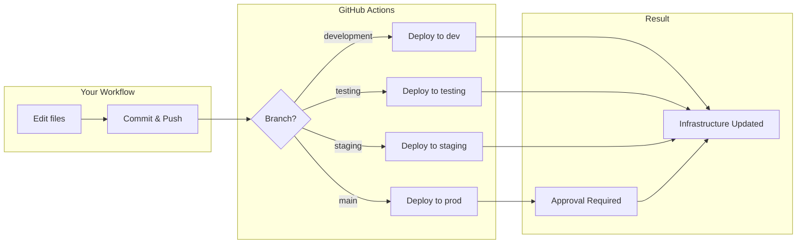

# Clustera Infrastructure

Infrastructure as code for the Clustera platform, managing Aiven Kafka topics and GCP Pub/Sub resources via Pulumi.

## How It Works

- **Pulumi** manages infrastructure as Python code
- **GitHub Actions** automatically deploys changes when you push
- **Cloudflare R2** stores Pulumi state (no Pulumi Cloud account needed)
- **Four environments**: development, testing, staging, prod

## Quick Start (Local Development)

```bash
# Install dependencies
make install

# Authenticate with GCP using your personal account
gcloud auth application-default login --project=clustera-control-plane

# Grant yourself permission to impersonate the service account (one-time)
gcloud iam service-accounts add-iam-policy-binding \
  pulumi-infrastructure@clustera-control-plane.iam.gserviceaccount.com \
  --member=user:YOUR_EMAIL@clustera.io \
  --role=roles/iam.serviceAccountTokenCreator

# Copy and configure credentials
cp .env.example .env
# Edit .env with your R2 and Aiven credentials
# Note: GCP auth is handled by gcloud, no keys needed in .env

# Initialize a stack
make init

# Preview and deploy
make preview
make up
```

## Deploying Changes

All deployments happen through Git. Push to a branch, and GitHub Actions deploys to the corresponding environment.

### Branch → Environment Mapping

| Branch | Stack | Auto-Deploy |
|--------|-------|-------------|
| `development` | development | Yes |
| `testing` | testing | Yes |
| `staging` | staging | Yes |
| `main` | prod | Yes (requires approval) |
| `steve1` | steve1 | Yes |

### Deployment Flow



### Pull Requests

When you open a PR, GitHub Actions runs `pulumi preview` and posts the planned changes as a comment. Review the preview before merging.

## Making Changes

### Adding Kafka Topics for a New Integration

1. Create directory: `infrastructure/integrations/integration-<name>/`
2. Add `kafka-topics.yaml`:

```yaml
# <Name> Integration Kafka Topics

topics:
  - name: "{stack}-integrations-worker-<name>"
    partitions: 1
    retention_ms: "259200000"      # 3 days
    retention_bytes: "629145600"   # 600 MB
```

Topics are auto-discovered from `kafka-topics.yaml` files and created on next deploy.

### Adding Data Plane Topics

Edit `infrastructure/data_plane/kafka-topics.yaml`:

```yaml
topics:
  - name: "{stack}-my-new-topic"
    partitions: 1
    replication: 3
    retention_ms: "604800000"      # 7 days
    retention_bytes: "-1"          # unlimited
```

### Default Topic Configuration

| Setting | Data Plane | Integrations |
|---------|------------|--------------|
| Partitions | 1-10 | 1 |
| Replication | 3 | 2 |
| Retention | 7 days | 3 days |
| Max Message | 25 MB | 25 MB |
| Compression | snappy | snappy |

## Project Structure

```
├── __main__.py                           # Pulumi entry point
├── infrastructure/
│   ├── core/                             # Core platform resources (future)
│   ├── control-plane/                    # Control plane resources (future)
│   ├── data_plane/                       # Data plane Kafka topics
│   │   ├── kafka.py                      # Topic creation logic
│   │   └── kafka-topics.yaml             # Topic definitions (17 topics)
│   └── integrations/
│       ├── shared/                       # Shared integration resources
│       │   ├── kafka.py                  # YAML-driven topic creation
│       │   └── kafka-topics.yaml         # Shared topics + DLQs
│       ├── integration-gmail/            # Gmail (Pub/Sub + Kafka)
│       ├── integration-slack/            # Slack
│       ├── integration-zoom/             # Zoom
│       ├── integration-google-drive/     # Google Drive
│       ├── integration-circle/           # Circle
│       └── integration-distribution/     # Distribution
├── Pulumi.yaml                           # Pulumi project config
├── Pulumi.{env}.yaml.example             # Per-environment config templates
├── .env.example                          # Credentials template
└── Makefile                              # Helper commands
```

## Resources Managed

### Aiven Kafka Topics

**Data Plane** (17 topics):
- Runtime, Cerebras, ingestion control
- HTTP, WebSocket, SSE, NGINX request/response topics

**Integrations** (10+ topics):
- Shared incoming records and errors
- Per-integration worker queues (Gmail, Slack, Zoom, etc.)
- Dead letter queues for failed messages

### GCP Pub/Sub

**Gmail Integration**:
- Topic for Gmail API push notifications
- IAM binding for `gmail-api-push@system.gserviceaccount.com`
- Push or pull subscription (configurable)

## Auditing Kafka Topics

To list existing topics and verify they're under management:

```bash
# Install Aiven CLI
pip install aiven-client

# Login
avn user login

# List all topics
avn service topic-list <kafka-service> --project <project>

# Or use Aiven Console
open https://console.aiven.io
```

## Promoting Changes

```bash
# Deploy to development
git checkout development
git pull && git merge feature/my-change
git push

# Promote to staging
git checkout staging
git pull && git merge development
git push

# Promote to production
git checkout main
git pull && git merge staging
git push
# → Requires approval in GitHub
```

## Environment Protection

- **Production resources** have deletion protection enabled
- **Production deploys** require manual approval via GitHub Environments
- **All secrets** are encrypted in stack configs

## GitHub Actions Configuration

GitHub Actions uses **Workload Identity Federation** to authenticate with GCP (no service account keys needed).

### Required GitHub Secrets

Configure these in your repository settings (`Settings → Secrets and variables → Actions`):

| Secret Name | Description | Example Value |
|-------------|-------------|---------------|
| `AWS_ACCESS_KEY_ID` | Cloudflare R2 access key | `abc123...` |
| `AWS_SECRET_ACCESS_KEY` | Cloudflare R2 secret key | `xyz789...` |
| `AWS_ENDPOINT_URL_S3` | R2 endpoint URL | `https://...r2.cloudflarestorage.com` |
| `PULUMI_CONFIG_PASSPHRASE` | Passphrase for stack secrets | `your-secure-passphrase` |
| `AIVEN_TOKEN` | Aiven API token | `your-aiven-token` |
| `GCP_WORKLOAD_IDENTITY_PROVIDER` | GCP Workload Identity Provider | `projects/.../workloadIdentityPools/.../providers/...` |
| `GCP_SERVICE_ACCOUNT` | GCP Service Account email | `pulumi-infrastructure@project.iam.gserviceaccount.com` |

### Setting up Workload Identity Federation

Run the setup script (requires GCP org admin or project owner):

```bash
./setup-gcp-workload-identity-v3.sh clustera-control-plane clusterahq clustera-infrastructure
```

This creates the Workload Identity Pool and Provider, then outputs the values for `GCP_WORKLOAD_IDENTITY_PROVIDER` and `GCP_SERVICE_ACCOUNT` secrets.

**Benefits of Workload Identity Federation:**
- ✅ No service account keys to manage or rotate
- ✅ More secure (credentials are short-lived tokens)
- ✅ Better compliance with GCP security best practices

## Adding a New Personal Environment

To create a new environment (e.g., `juan1`):

1. **Add branch to workflow** (`.github/workflows/pulumi-deploy.yml`):
   ```yaml
   branches:
     - juan1  # Add to both push and pull_request sections
   ```

2. **Add stack mapping** (in both `preview` and `deploy` jobs):
   ```bash
   case "${{ github.ref_name }}" in
     ...
     juan1) echo "stack=juan1" >> $GITHUB_OUTPUT ;;
   ```

3. **Create stack config** (`Pulumi.juan1.yaml`):
   ```yaml
   config:
     clustera-infrastructure:aiven_project: clustera-creators
     clustera-infrastructure:kafka_service: kafka-clustera
     clustera-infrastructure:gcp_project: clustera-control-plane
     gcp:project: clustera-control-plane
     gcp:region: us-central1
   ```

4. **Commit and push**:
   ```bash
   git checkout -b juan1
   git add .github/workflows/pulumi-deploy.yml Pulumi.juan1.yaml
   git commit -m "Add juan1 environment"
   git push -u origin juan1
   ```

GitHub Actions will create all topics with the `juan1-` prefix (e.g., `juan1-runtime`, `juan1-integrations-worker-gmail`).

**Note**: Personal dev branches automatically use the `development` GitHub Environment for secrets (AIVEN_TOKEN, GCP credentials, R2 credentials, etc.). No additional GitHub Environment configuration needed.

## Makefile Commands

```bash
make help             # Show all available commands
make install          # Install dependencies with uv
make init             # Initialize Pulumi stack (interactive)
make preview          # Preview infrastructure changes
make up               # Deploy infrastructure
make outputs          # Show stack outputs
make refresh          # Sync state with cloud
make destroy          # Destroy infrastructure (careful!)
make select-dev       # Switch to development stack
make select-staging   # Switch to staging stack
make select-prod      # Switch to production stack
```

## Configuration

### Required Pulumi Config

```bash
pulumi config set aiven_project <project-name>
pulumi config set kafka_service <kafka-service-name>
pulumi config set gcp_project <gcp-project-id>
pulumi config set gcp:project <gcp-project-id>
pulumi config set gcp:region us-central1
```

### Optional Config

```bash
# Gmail webhook endpoint (if not set, creates pull subscription)
pulumi config set gmail_webhook_endpoint https://your-endpoint.com/webhook
```

### Environment Variables (.env)

```bash
# R2 Backend
AWS_ACCESS_KEY_ID=<r2-access-key>
AWS_SECRET_ACCESS_KEY=<r2-secret-key>
AWS_REGION=auto
AWS_ENDPOINT_URL_S3=https://<account-id>.r2.cloudflarestorage.com

# Secrets encryption
PULUMI_CONFIG_PASSPHRASE=<passphrase>

# Aiven
AIVEN_TOKEN=<aiven-api-token>

# GCP (Local Development)
# Use service account impersonation (recommended)
GOOGLE_IMPERSONATE_SERVICE_ACCOUNT=pulumi-infrastructure@clustera-control-plane.iam.gserviceaccount.com
# First authenticate: gcloud auth application-default login --project=clustera-control-plane
```

## Troubleshooting

### State Lock Issues
```bash
pulumi cancel
```

### Authentication Errors
```bash
# Aiven - set token
export AIVEN_TOKEN=your_token

# GCP - re-authenticate with your personal account
gcloud auth application-default login --project=clustera-control-plane

# GCP - verify impersonation is set
export GOOGLE_IMPERSONATE_SERVICE_ACCOUNT=pulumi-infrastructure@clustera-control-plane.iam.gserviceaccount.com

# R2 - verify login
pulumi login s3://clustera-infrastructure-pulumi
```

### Gmail Pub/Sub IAM Error

If you get "One or more users named in the policy do not belong to a permitted customer":

```bash
# Override org policy (one-time, requires org admin)
gcloud org-policies reset iam.allowedPolicyMemberDomains --project=<project-id>
```

## Documentation

- [Initial Setup](docs/setup.md) - One-time setup for R2, Aiven, GCP, and GitHub secrets
- [Local Development](docs/local-development.md) - Running Pulumi commands locally
- [CI/CD Workflow](.github/workflows/README.md) - Detailed workflow documentation
