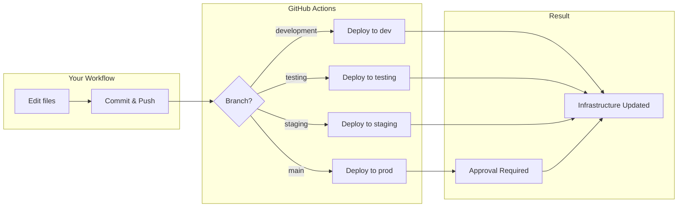

# Clustera Infrastructure

Infrastructure as code for the Clustera platform, managing Aiven Kafka topics and GCP Pub/Sub resources via Pulumi.

## How It Works

- **Pulumi** manages infrastructure as Python code
- **GitHub Actions** automatically deploys changes when you push
- **Cloudflare R2** stores Pulumi state (no Pulumi Cloud account needed)
- **Four environments**: development, testing, staging, prod

## Deploying Changes

All deployments happen through Git. Push to a branch, and GitHub Actions deploys to the corresponding environment.

### Branch → Environment Mapping

| Branch | Environment | Auto-Deploy |
|--------|-------------|-------------|
| `development` | development | Yes |
| `testing` | testing | Yes |
| `staging` | staging | Yes |
| `main` | prod | Yes (requires approval) |

### Deployment Flow



### Pull Requests

When you open a PR, GitHub Actions runs `pulumi preview` and posts the planned changes as a comment. Review the preview before merging.

## Making Changes

### Adding or Modifying Kafka Topics

Edit `infrastructure/integrations/shared/kafka-topics.yaml`:

```yaml
topics:
  - name: "{stack}-my-new-topic"        # {stack} is replaced with environment name
    partitions: 1
    retention_ms: "259200000"            # 3 days
    retention_bytes: "629145600"         # 600 MB
```

### Adding New Infrastructure

1. Create or edit modules in the appropriate category under `infrastructure/`
2. Export from the category's `__init__.py`
3. Import and call from `__main__.py`
4. Commit and push

## Project Structure

```
├── __main__.py                      # Pulumi entry point
├── infrastructure/
│   ├── core/                        # Core platform resources
│   ├── data_plane/                  # Data plane resources
│   ├── control_plane/               # Control plane resources
│   └── integrations/
│       ├── shared/                  # Shared integration resources
│       │   ├── kafka.py             # Aiven Kafka topics
│       │   └── kafka-topics.yaml    # Kafka topic definitions
│       ├── integration_gmail/       # Gmail integration
│       │   └── pubsub.py            # GCP Pub/Sub
│       └── integration_circle/      # Circle integration
├── Pulumi.yaml                      # Pulumi project config
└── Pulumi.{env}.yaml                # Per-environment settings
```

## Promoting Changes

```bash
# Deploy to development
git checkout development
git pull && git merge feature/my-change
git push

# Promote to staging
git checkout staging
git pull && git merge development
git push

# Promote to production
git checkout main
git pull && git merge staging
git push
# → Requires approval in GitHub
```

## Environment Protection

- **Production resources** have deletion protection enabled
- **Production deploys** require manual approval via GitHub Environments
- **All secrets** are encrypted in stack configs

## Documentation

- [Initial Setup](docs/setup.md) - One-time setup for R2, Aiven, GCP, and GitHub secrets
- [Local Development](docs/local-development.md) - Running Pulumi commands locally
- [CI/CD Workflow](.github/workflows/README.md) - Detailed workflow documentation
